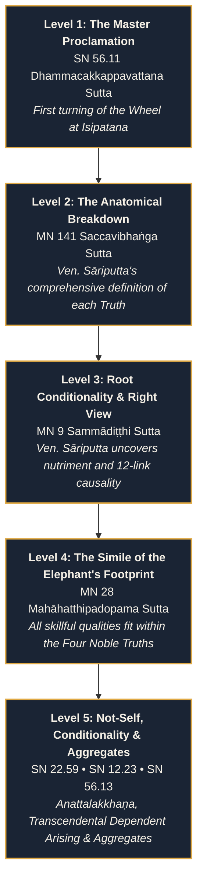

# The Lay Dharma Household Mārga ☸
### *(Upāsaka-Dharma & The Householder's Canonical Study Portal)*

<div align="center">

[](LICENSE)
[](#-the-canonical-corpus--concordance)
[](#-technical-architecture)
[](#-bilingual-engine-en--pt-br)
[](#-quick-start--local-deployment)
[](#-technical-architecture)

<p align="center">
  <br />
  <strong>“Dhammo have rakkhati dhammacāriṁ”</strong><br />
  <em>“The Dhamma protects the one who lives by the Dhamma.”</em>
  <br /><br />
</p>

> **A focused, canonical study portal and doctrinal reference built for Buddhist laypeople—providing direct access to foundational Early Buddhist teachings, precise Pāli terminology, authentic sutta translations, and practical guidance for living the Dhamma in the everyday household.**

[☸ Explore The 9 Pillars](#-the-9-canonical-study-pillars) •
[🏛️ Portal Architecture](#-study-portal-architecture) •
[⚖️ Catukicca Matrix](#-the-fourfold-operational-practice-catukicca) •
[📖 Canonical Progression](#-canonical-study-progression-pillar-01) •
[⚡ Quick Start](#-quick-start--local-deployment) •
[📜 Sutta Concordance](#-the-canonical-corpus--concordance)

---

</div>

## 📌 Table of Contents

- [☸ Purpose & Doctrinal Scope](#-purpose--doctrinal-scope)
  - [What This Platform Is](#what-this-platform-is)
  - [What This Platform Is NOT](#what-this-platform-is-not)
- [🏛️ The 9 Canonical Study Pillars](#-the-9-canonical-study-pillars)
- [📖 Study Portal Architecture](#-study-portal-architecture)
  - [Tab 1: Overview & Essence](#tab-1-overview--essence)
  - [Tab 2: Canonical Corpus](#tab-2-canonical-corpus)
  - [Tab 3: Householder Practice (Gahapati-Dharma)](#tab-3-householder-practice-gahapati-dharma)
- [⚖️ The Fourfold Operational Practice (Catukicca)](#-the-fourfold-operational-practice-catukicca)
- [🗺️ Canonical Study Progression (Pillar 01)](#-canonical-study-progression-pillar-01)
- [🌐 Bilingual Engine (EN / PT-BR)](#-bilingual-engine-en--pt-br)
- [🎨 Sacred Aesthetic & Design System](#-sacred-aesthetic--design-system)
- [💻 Technical Architecture](#-technical-architecture)
  - [File & Directory Layout](#file--directory-layout)
  - [Zero-Dependency Standalone Bundle](#zero-dependency-standalone-bundle)
- [🚀 Quick Start & Local Deployment](#-quick-start--local-deployment)
- [📚 The Canonical Corpus & Concordance](#-the-canonical-corpus--concordance)
- [🛡️ Ethical Heritage & Dedication](#-ethical-heritage--dedication)

---

## ☸ Purpose & Doctrinal Scope

The mission of **The Lay Dharma Household Mārga** is singular: to restore direct, unadulterated access to the foundational discourses (*suttas*) of the Buddha for serious lay practitioners (*upāsakas* and *upāsikās*). 

In traditional Buddhist history, the Buddha did not teach an escapist or purely monastic doctrine; he repeatedly guided householders, merchants, ministers, artisans, and family stewards (*gahapatis*) on how to realize awakening (*bodhi*), cultivate psychological clarity, build ethical prosperity, and sever the root roots of stress (*dukkha*) directly amidst household and domestic obligations.

```
                          ┌──────────────────────────────┐
                          │   DHAMMACAKKAPPAVATTANA      │
                          │   The Wheel of the Dhamma    │
                          └──────────────┬───────────────┘
                                         │
                 ┌───────────────────────┴───────────────────────┐
                 ▼                                               ▼
   ┌───────────────────────────┐                   ┌───────────────────────────┐
   │    DOCTRINAL ACCURACY     │                   │   HOUSEHOLDER INTEGRATION │
   │ • Pāli Root Terminology   │                   │ • Domestic Governance     │
   │ • Canonical Nikāya Suttas │                   │ • Ethical Livelihood      │
   │ • Authentic Catukicca     │                   │ • Conflict Transmutation  │
   │ • SuttaCentral Deep-Links │                   │ • Daily Contemplation     │
   └───────────────────────────┘                   └───────────────────────────┘
```

### What This Platform Is:
- **An Authentic Doctrinal Study Reference**: A curated, systematic breakdown of essential Buddhist frameworks directly rooted in the canonical Early Buddhist texts (*Tipiṭaka / Nikāyas*).
- **A Precision Translation & Pāli Lexicon**: Clear definitions of crucial Pāli vocabulary (*dukkha*, *taṇhā*, *vedanā*, *idappaccayatā*, *yoniso manasikāra*), counteracting common modern misconceptions.
- **A Householder's Operational Roadmap**: Actionable guidance for translating classical ethical frameworks, reciprocal duties, and wisdom practices into domestic life, family stewardship, financial governance, and career decisions.
- **An In-Page Deep Study Portal**: An interactive study portal featuring an illuminated 9-spoke radial wheel (*Dharmachakra*), sequential study progressions, parallel bilingual translations, and persistent navigation.

### What This Platform Is NOT:
- **Not a meditation timer or wellness app**: There are no breathing counters, ambient relaxation loops, gamified streaks, or mindfulness gimmicks.
- **Not generic secular self-help**: The material preserves the ontological depth, ethical weight, and liberation goal of classical Theravāda Buddhism without watering down canonical terminology.

---

## 🏛️ The 9 Canonical Study Pillars

The portal organizes core canonical teachings through a 9-spoke radial wheel interface (*Dharmachakra*), each sector representing a foundational domain of practice:

| # | Pāli Title | English Title | Canonical References | Core Doctrinal Domain |
|---|---|---|---|---|
| **01** | **Cattāri Ariyasaccāni** | The Four Noble Truths | SN 56.11, MN 141, MN 9, MN 28, SN 22.59, SN 12.23, SN 56.13 | The clinical master diagnosis: stress, origin, cessation, and path. |
| **02** | **Paṭiccasamuppāda** | Dependent Arising in Everyday Life | SN 12.2, SN 12.15, MN 9, SN 12.20, SN 12.23, DN 15, SN 12.11, SN 12.17, SN 12.38, SN 36.6, SN 35.28, SN 47.13 | The master conditionality principle (*idappaccayatā*), 12 Links Explorer (Canonical vs Everyday Modes), 12 Suttas Library, 5 realistic lay scenarios, 7-step guided reflection exercise, 3 study tracks, reflection journal, and 10 canonical FAQs. |
| **03** | **Bhāvanā** | Samatha & Vipassanā | MN 118, AN 4.170, SN 46.51 | Calming the mind (*samatha*) and experiential analytical insight (*vipassanā*) as yoked wings. |
| **04** | **Cattāro Satipaṭṭhānā** | Four Foundations of Mindfulness | DN 22, MN 10, SN 47.19 | Mindfulness of the body (*kāya*), feelings (*vedanā*), mind (*citta*), and phenomena (*dhammā*). |
| **05** | **Brahmavihārā** | Four Sublime Abodes | Snp 1.8, DN 13, MN 99 | Universal social virtues: loving-kindness (*mettā*), compassion (*karuṇā*), appreciative joy (*muditā*), and equanimity (*upekkhā*). |
| **06** | **Gihivinaya** | Sigālovāda & Householder Ethics | DN 31, AN 8.54, AN 4.62 | The "Vinaya of the Householder": reciprocal relationship duties, 4-part financial stewardship, vocational integrity. |
| **07** | **Dhammapada** | The Path of the Dhamma | Khuddaka Nikāya (423 Verses) | Practical aphorisms and verses on vigilant mind-guarding, ethical restraint, and discerning wisdom. |
| **08** | **Jātakāni & Pāramīs** | Virtues in Action & Perfections | Khuddaka Nikāya, Jātaka Aṭṭhakathā | Exemplary narratives on cultivating the 10 perfections (*dāna*, *sīla*, *khanti*, *viriya*, *sacca*) in worldly challenges. |
| **09** | **Lokadhātu & Bhavacakra** | Buddhist Cosmology in the Theravāda Tradition | DN 27, DN 1, AN 3.80, MN 135, MN 136, AN 6.63, SN 15.3, DN 11, DN 13, MN 49, AN 4.77, SN 56.48, AN 8.54, AN 5.57, DN 16 | The comprehensive traditional cosmological framework: 31 Planes of Existence Explorer, 15 Essential Suttas Library with SuttaCentral deep-links, 5 realistic domestic scenarios, educational kamma & non-victim blaming safeguards, interactive 6-dilemma ethical decision exercise, "Nibbāna Is Not Another Realm", 3 guided study tracks (7, 14, 30 days), reflection journal, and 14 canonical FAQs. |

---

## 📖 Study Portal Architecture

When a student selects any of the 9 pillars on the radial wheel, the application transitions smoothly into a full in-page study portal divided into three dedicated, illuminated tabs:

```
┌────────────────────────────────────────────────────────────────────────┐
│                        DEEP STUDY PORTAL                               │
├────────────────────┬─────────────────────┬─────────────────────────────┤
│ 1. OVERVIEW &      │ 2. CANONICAL        │ 3. HOUSEHOLDER              │
│    ESSENCE         │    CORPUS           │    PRACTICE                 │
│                    │                     │                             │
│ • Doctrinal Matrix │ • 5-Level Roadmap   │ • Authentic Lay Guidance    │
│ • Catukicca Duties │ • Parallel Texts    │ • 8-Fold Path Householder   │
│ • Terminology Grid │ • Direct SC Links   │ • Psychological Guardrails  │
└────────────────────┴─────────────────────┴─────────────────────────────┘
```

### Tab 1: Overview & Essence
- **Lead Doctrinal Overview**: Clear thematic exposition presenting the essential spiritual principle and its relevance.
- **The Catukicca Framework**: Explicit clarification of the four operational duties required by the truth, dismantling modern popularized misconceptions.
- **Pāli Terminology Lexicon**: An illuminated card grid defining critical Pāli roots, compound expressions, and contextual meanings to avoid modern secular distortions.

### Tab 2: Canonical Corpus
- **Structured Study Progression**: Sequenced learning levels guiding the student systematically from initial proclamation to deep ontological conditionality.
- **Parallel Canonical Sutta Excerpts**: Side-by-side presentation of original Romanized Pāli alongside authentic, faithful English and Portuguese translations.
- **SuttaCentral Deep Integration**: Direct outbound links to [SuttaCentral](https://suttacentral.net) for every discourse, allowing verification against full canonical root texts.

### Tab 3: Householder Practice (Gahapati-Dharma)
- **Concrete Lay Applications**: Explicit behavioral strategies for conflict resolution, ethical speech in corporate environments, equitable household resource allocation, and domestic emotional balance.
- **The Noble Eightfold Path Lay Module**: Exhaustive breakdown of each factor of the *Ariya Aṭṭhaṅgika Magga* (*Sammā-diṭṭhi* through *Sammā-samādhi*) translated into concrete household actions.
- **Behavioral Safeguards**: Direct psychological guardrails preventing common lay traps (spiritual bypassing, sectarian dogmatism, and moral laxity).

---

## ⚖️ The Fourfold Operational Practice (Catukicca)

A distinguishing feature of **The Lay Dharma Household Mārga** is its uncompromising adherence to canonical Theravāda doctrine. The Four Noble Truths are not philosophical doctrines to be debated or mere "beliefs"—they are four distinct **operational duties** (*catukicca*):

```
                   THE FOURFOLD OPERATIONAL MATRIX
                   
   NOBLE TRUTH                 CANONICAL DUTY (KICCA)       AUTHENTIC ACTION
┌───────────────────────────┬───────────────────────────┬───────────────────────────┐
│ 1. DUKKHA                 │ Pariññeyya                │ To be FULLY UNDERSTOOD    │
│    (Stress / Friction)    │ (Diagnose thoroughly)     │ (Not avoided or escaped)  │
├───────────────────────────┼───────────────────────────┼───────────────────────────┤
│ 2. SAMUDAYA               │ Pahātabba                 │ To be ABANDONED AT ROOT   │
│    (Craving / Origin)     │ (Relinquish cause)        │ (Not managed or indulged) │
├───────────────────────────┼───────────────────────────┼───────────────────────────┤
│ 3. NIRODHA                │ Sacchikātabba             │ To be DIRECTLY REALIZED   │
│    (Cessation / Unbinding)│ (Verify cessation)        │ (Not imagined or waited)  │
├───────────────────────────┼───────────────────────────┼───────────────────────────┤
│ 4. MAGGA                  │ Bhāvetabba                │ To be CULTIVATED DAILY    │
│    (The Eightfold Path)   │ (Develop systematically)  │ (Not intellectualized)    │
└───────────────────────────┴───────────────────────────┴───────────────────────────┘
```

> **Canonical Ref (SN 56.11):**  
> *“Taṁ kho panidaṁ dukkhaṁ ariyasaccaṁ pariññeyyanti me, bhikkhave... pariññātanti me, bhikkhave...”*  
> *“‘This noble truth of suffering is to be fully understood’... ‘has been fully understood’—thus there arose in me vision, knowledge, wisdom, true learning, and light.”*

---

## 🗺️ Canonical Study Progression (Pillar 01)

Rather than presenting isolated, disjointed quotations, Pillar 01 organizes the study of the Four Noble Truths across a coherent 5-level curriculum:



---

## 🌐 Bilingual Engine (EN / PT-BR)

The platform features an instant, reactive bilingual switch between **English** and **Brazilian Portuguese (*Português*)**:

- **Flag Vector Icons**: Custom SVG flags representing the United States and Brazil.
- **Deep Translation Coverage**: Every UI string, hub sector, glossary entry, doctrinal matrix item, sutta citation, translation excerpt, and householder guidance item is fully translated natively.
- **Persistence**: Remembers language preference across browser reloads via `localStorage`.
- **Zero Libraries**: Implemented with pure ES6+ state management without bloating page weight.

---

## 🎨 Sacred Aesthetic & Design System

The application uses a custom-crafted visual theme designed to encourage calm, contemplative focus (*samādhi*):

- **Palette**:
  - `Obsidian Core` (`#090c10`): Deep meditative backdrop minimizing eye strain.
  - `Sacred Saffron Gold` (`#e0a944`, `#f5c76b`, `#b88126`): Canonical reverence and warmth.
  - `Jade Calm` (`#3ea876`): Harmonious mental equilibrium.
  - `Pāli Ochre` (`#e9c17b`): Distinctive highlighting for classical terms.
- **Typography**:
  - **Headings**: *Cinzel* & *Cinzel Decorative* (classical sacred monumental script).
  - **Body Text**: *Inter* (crystal-clear readability).
  - **Canonical Texts**: *Noto Serif* (distinguished literary serif with full Pāli diacritics support: `ā`, `ī`, `ū`, `ḍ`, `ḷ`, `ṁ`, `ṅ`, `ñ`, `ṇ`, `ṭ`).
- **Interactive Dharmachakra**:
  - Pure SVG vector wheel with 9 precisely aligned interactive sectors.
  - Dynamic gold aura, hub hover tooltips, and keyboard accessibility.

---

## 💻 Technical Architecture

The codebase has been engineered with an uncompromising **zero external runtime dependencies** architecture.

```
📁 The Lay Dharma Household Mārga/
├── 📄 index.html                     # Semantic HTML5 single-page application & in-page portal
├── 📁 css/
│   └── 📄 style.css                  # Custom meditative design system & responsive layout
├── 📁 js/
│   ├── 📄 app.js                     # Main application controller, wheel SVG logic, i18n
│   ├── 📄 audioBell.js               # Pure Web Audio API Tibetan Singing Bowl synthesizer (432 Hz)
│   ├── 📄 bundle.js                  # Standalone bundled script for file:// and offline use
│   └── 📁 data/
│       ├── 📄 fourthNobleTruthData.js # Canonical 4th Noble Truth & 8-Fold Path lay module
│       └── 📄 topicsData.js          # Core canonical data, suttas, glossary, and i18n strings
├── 📄 build_bundle.ps1               # Automated PowerShell build script for standalone bundle
├── 📄 server.ps1                     # Embedded zero-dependency PowerShell HTTP server (Port 8081)
├── 📄 Start_The_Lay_Dharma.bat       # Windows 1-click launcher batch script
├── 📄 .gitignore                     # Git hygiene file
└── 📄 README.md                      # Comprehensive project documentation
```

### Zero-Dependency Standalone Bundle

For maximum portability and longevity, the project includes an automated PowerShell bundler ([build_bundle.ps1](file:///c:/Users/Mhatayur/Desktop/SOFTWARE%20CREATION/The%20Lay%20Dharma%20Household%20M%C4%81rga/build_bundle.ps1)).

The bundler strips ES6 module wrappers and packages `fourthNobleTruthData.js`, `topicsData.js`, and `app.js` into an immediately executable `bundle.js`, allowing the application to run smoothly even over the restrictive `file://` protocol without requiring any web server!

```powershell
# Rebuild the standalone bundle at any time
powershell -ExecutionPolicy Bypass -File .\build_bundle.ps1
```

---

## 🚀 Quick Start & Local Deployment

You can run **The Lay Dharma Household Mārga** immediately on any modern web browser using three straightforward methods:

### Method 1: Instant Direct File Execution (Zero Install)
Simply double-click or open [index.html](file:///c:/Users/Mhatayur/Desktop/SOFTWARE%20CREATION/The%20Lay%20Dharma%20Household%20M%C4%81rga/index.html) in your favorite browser (Chrome, Firefox, Edge, Safari). No server or build process required.

### Method 2: One-Click Windows Launcher
Double-click `Start_The_Lay_Dharma.bat` in the repository root. This immediately launches the embedded local HTTP server and opens your browser to `http://localhost:8081`.

### Method 3: PowerShell Local Server
Run the built-in HTTP server script directly in PowerShell:
```powershell
powershell -ExecutionPolicy Bypass -File .\server.ps1
```
Then navigate to:
```
http://localhost:8081
```

---

## 📚 The Canonical Corpus & Concordance

Every citation within this portal references the authentic Pāḷi Tipiṭaka (*Sutta Piṭaka*):

### Dīgha Nikāya (Long Discourses)
- **DN 15 (*Mahānidāna Sutta*)**: The Great Causes Discourse on Dependent Arising.
- **DN 22 (*Mahāsatipaṭṭhāna Sutta*)**: The Great Discourse on the Four Foundations of Mindfulness.
- **DN 31 (*Sigālovāda Sutta*)**: The Layperson's Code of Discipline (*Gihivinaya*).

### Majjhima Nikāya (Middle Length Discourses)
- **MN 9 (*Sammādiṭṭhi Sutta*)**: Right View discourse by Ven. Sāriputta.
- **MN 10 (*Satipaṭṭhāna Sutta*)**: Direct contemplative contemplation of body, feeling, mind, and dhammas.
- **MN 28 (*Mahāhatthipadopama Sutta*)**: The Simile of the Elephant's Footprint.
- **MN 118 (*Ānāpānasati Sutta*)**: Mindfulness of Breathing through 16 contemplative steps.
- **MN 141 (*Saccavibhaṅga Sutta*)**: Ven. Sāriputta's comprehensive breakdown of the Four Noble Truths.

### Saṁyutta Nikāya (Connected Discourses)
- **SN 12.2 (*Vibhaṅga Sutta*)**: Detailed analysis of the 12 links of Dependent Arising.
- **SN 12.23 (*Upanisa Sutta*)**: The Transcendental Dependent Arising leading from suffering to liberation.
- **SN 12.65 (*Nagara Sutta*)**: The Ancient City discourse on discovering conditionality.
- **SN 22.59 (*Anattalakkhaṇa Sutta*)**: The Discourse on the Characteristic of Not-Self.
- **SN 56.11 (*Dhammacakkappavattana Sutta*)**: Setting in Motion the Wheel of the Dhamma.
- **SN 56.13 (*Khandha Sutta*)**: The discourse defining the five clinging-aggregates as stress.

### Aṅguttara Nikāya (Numbered Discourses)
- **AN 4.62 (*Anaṇa Sutta*)**: The four kinds of happiness for householders (ownership, wealth, debtlessness, blamelessness).
- **AN 8.54 (*Vyagghapajja / Dīghajāṇu Sutta*)**: Conditions for welfare and happiness in this life and the next.

### Khuddaka Nikāya (Minor Collection)
- **Dhammapada (Dhp)**: Selected verses on mind vigilance, ethical restraint, and discernment.
- **Sutta Nipāta (Snp 1.8 - *Karaṇīya Mettā Sutta*)**: Contemplation of boundless loving-kindness.
- **Jātaka Aṭṭhakathā**: Narrative expositions of the Ten Perfections (*dasa pāramiyo*).

---

## 🛡️ Ethical Heritage & Dedication

> *“Sabbapāpassa akaraṇaṁ, kusalassa upasampadā;*  
> *Sacittapariyodapanaṁ, etaṁ buddhāna sāsanaṁ.”*  
>  
> *“Not to do any evil, to cultivate the wholesome,*  
> *to purify one's own mind—this is the teaching of the Buddhas.”*  
> — **Dhammapada 183**

This project is created and distributed in the spirit of **Dhamma-dāna** (the gift of Dhamma, which excels all other gifts). May this study tool support householders everywhere in cultivating wise reflection (*yoniso manasikāra*), safeguarding their families with ethical discernment, and progressing unswervingly on the Noble Path.

*Software code released under the [MIT License](LICENSE).*
